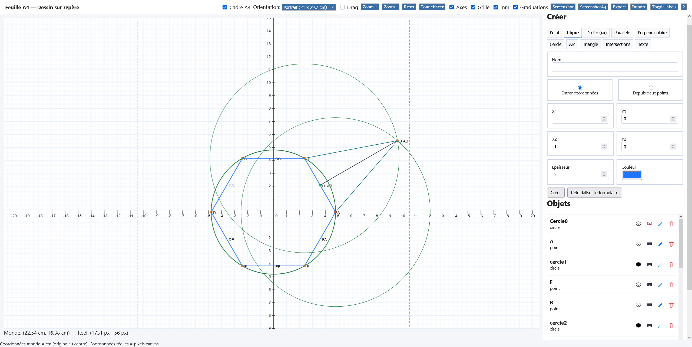
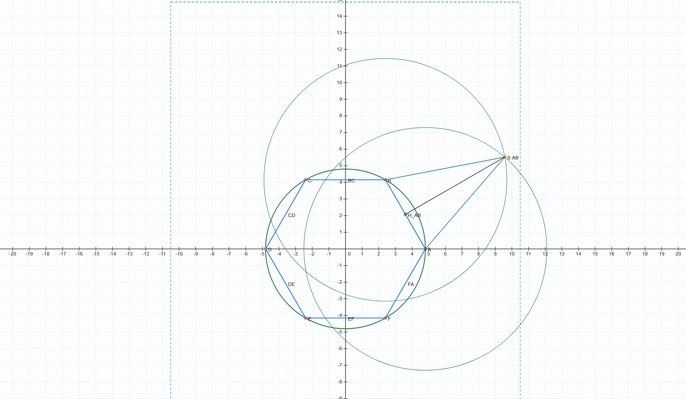

```markdown
# @cednieb/geo


Un petit ensemble d'utilitaires géospatiaux pour JavaScript, ciblé et léger.

Idéal pour des cours de géométrie.

Constructions de figures.

Import / Export.

Captures d'écran.

Utilisation dans le navigateur.

Contribution

Les contributions sont les bienvenues ! Quelques règles :
1. Ouvrez une issue pour discuter des changements importants avant de les implémenter.
2. Suivez le style de code existant et ajoutez des tests pour les nouvelles fonctionnalités.
3. Exécutez les tests localement avant d'envoyer une PR.

Support

Pour les bugs et demandes de fonctionnalités, ouvrez une issue dans le dépôt : https://github.com/cednieb/geo/issues

Licence


Mainteneurs

- cednieb (https://github.com/cednieb)

# Interface


# Capture d'écran


# CaptureA4

```
